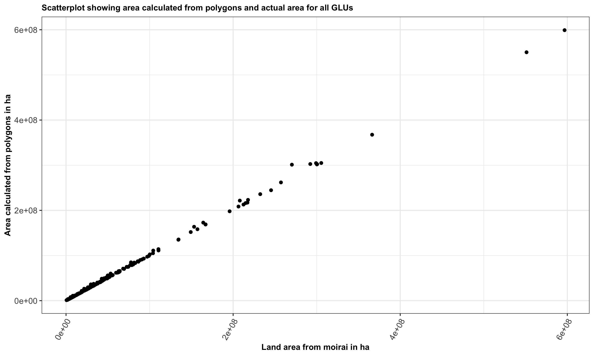
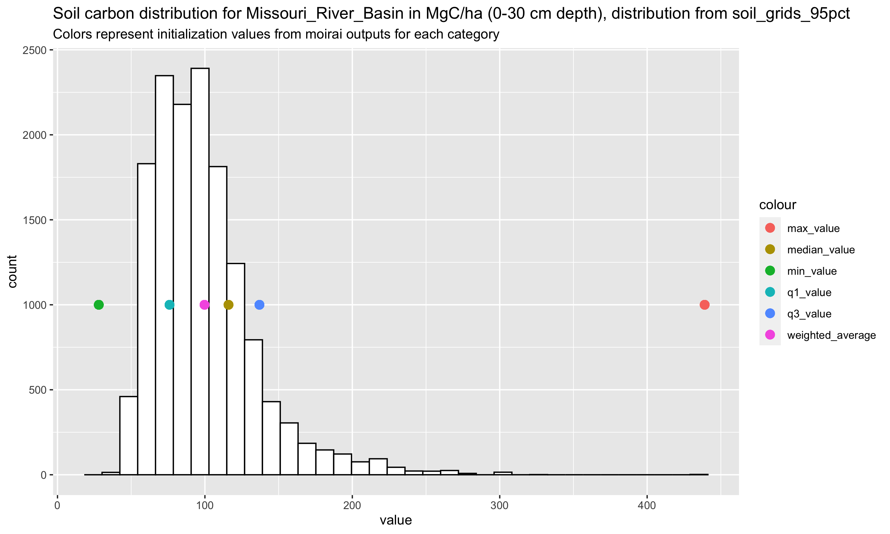

---
output:
  word_document: default
  html_document: default
---
# Diagnostics and exporation functions for  `moirai`  

# Description:
This folder contains a number of diagnostics scripts and functions that can be used to verify, analyze and explore the outputs of the `moirai` LDS. There are 3 types of diagnostics and exploration outputs that can be currently generated from moirai 

(1) Spatial products (shape files and rasters) based on moirai land data outputs;
(2) Analysis of carbon outputs (soil and vegetation);
(3) Verification and checks on land outputs.

Note: `moirai_diagnostics_vignette.rmd` provides examples of all of the functions for (2),(3). 

# Generating spatial products using land outputs from moirai

The script `generate_moirai_spatial.R` located in the diagnostics folder can be used to generate various spatial products using the outputs of the moirai LDS. 

## Summary of outputs

The script generates a set of 18 shape files or vector files. vector files are generated at 3 main spatial levels, namely country, region, basin. In addition to this, files are generated for different intersections for the 3 main categories, intersections for country and basin boundaries (country_basin), region and basinboundaries (region_basin) and region and country boundaries (region_country). Since the land data system does not generate land area information for all cells within the above mentioned boundaries (for water bodies for example), the vectors are presented for 3 main classes for each spatial category, land cells, cells with no land and combined. 

Th plots below show outputs for basin boundaries(Figure 1) and country boundaries (Figure 2) for the combined (land +noland) category.

column names in outputs:

(1) `key`: Unique identifier for feature
(2) `reg_id`: Unique identifier for region (region number)
(3) `ctry_id`:Uniqueidentifier for country (country number) 
(4) `glu_id`: Uniqueidentifier for glu (basin number)
(5) `reg_nm`: Region name 
(6) `ctry_nm`: Country name
(7) `glu_nm`: glu/basin name

In addition to the main outputs, the code also generates the following outputs in case required by the user:
(1) raster files (.tif files) for each of the 18 files described above
(2) mapping files (CSV files) for each of the 6 spatial boundaries 
(3) raw shape files i.e. shapefiles without any metadata (in case user would like to add their own metadata)
(4) diagnostics related to area calculated from the shape files.

## Inputs required

All inputs required by the user are stored in the folder `spatial_input_files/` The inputs required and their usage is described below,

(1) `valid_land_area.bil` which is raster containing information on valid land area output by moirai. This is required for the purpose of validation.
(2) `country_out.bil` and `country_out_noland.bil` which represent the the valid country boundaries with and without land cells respectively.
(3) `glu_raster.bil` and `glu_raster_noland.bil` which represent the the valid basin/glu boundaries with and without land cells respectively.
(4) `region_gcam_out.bil` and `region_gcam_out_noland.bil` which represent the the valid basin/glu boundaries with and without land cells respectively.
(5) `GCAM_region_names.csv` which is used to fill in region names (metadata)
(6) `FAO_iso_VMAP0_ctry.csv` which is used to fill in country names (metadata)
(7) `Global235_CLM_5arcmin.csv` which is used to fill in basin names (metadata)

### Note - To update spatial inputs, please copy files (1) to (4) from the `outputs/` directory. Files (5)-(7) are in the `indata` directory. Please copy in these input files as well, in case they have been modified. 

## Additional software required

The polygonization code within the script requires either OSGEO to be installed (which is recommended to be installed for Windows users) or gdal bindings in python (which is recommended for MAC users). The user would either have to provide the path to a OSGEO .bat file in case of the former or to the location of the gdal_polygonize.py file in case of the latter.

## User defined/customizable parameters

In addition to the inputs described above, the user can specify/change values for a number of parameters. They are as follows,

(1) `no_data_value_moirai`: This is the NODATA value for moirai. It is currently set to -9999
(2) `hole_filling_threshold`: This is the threshold in $m^2$ above which all holes in polygons will be filled for the 'combined' shapefiles. New holes are introduced when merging the land and the no_land cells to generate the boundaries. The hole filling is applied (only to the combined shapefiles) to ensure that they can be used within other systems. 

Note: The hole filling threshold may sometimes fill in data for water bodies (where boundaries are not available for the water bodies because of inlets). An example of where this occurs is Lake Maracaibo in Venezuela. Because of this, we recommend that the combined shapefiles be considered only as political boundaries and not a representation of actual land.

(3) `raster_combinations`: This is a vector of the different boundaries for which shapefiles can be generated. Currently, shapefiles are generated for all 6 spatial boundaries described above. But the user can also run the script for a selected set of boundaries by manipulating this parameter.
(4)`use_osgeo`: This is a boolean that when set to TRUE will use osgeo. Otherwise, gdal_polygonize.py will be used for the polygonization (converting rasters to polygons). 
(5)`pypath`: The path to python on the user computer. This is required only in cases where osgeo is not used/available (mostly for MAC users)
(6)`gdalpolygonize_path`: This is the path to the gdal_polygonize.py file. Once again, this needs to be defined onlt in cases where osgeo is not used.

## Validation

There are a number of validation checks that are implemented within the script. These includes,

(1) Checks to ensure the rasters for different rasters are aligned and standardized
(2) Checks to ensure the rasters are aligned with the CSV land outputs of moirai
(3) Checks to ensure metadata is added for all features correctly and no features are dropped.

Figure 4 below is a validation plot (generated by the script) that compares the geometrical area of polygons for the basin level shapefile with the actual (terrain area) from the CSV outputs at the basin level. The small differences we observe are related to pixelsat coastal terrain for islands where moirai generates a smaller value of area per pixel (this 
happens because this terrain contains both land and water). For these locations the geometric area calculated from the shapefiles does not exactly match the actual area on account of the terrain.

# Functions to analyze/explore carbon outputs

## Introduction

`moirai` produces results on soil carbon (for a depth of 0-30 cms) and vegetation carbon (above and below ground biomass) by iso,basin, and land types (HYDE and SAGE). 

Carbon numbers are presented for 6 states, namely weighted_average, median, minimum, maximum, quartile 1 and quartile 3. In addition to this, the user can also select the source of the soil carbon data (soilgrids for 2 categories (mean or 95th percentile) or the Harmonized World Soil Database from the FAO).    

These carbon outputs are stored in the file `Ref_veg_carbon_Mg_per_ha.csv` in the outputs folder. The user can explore results for any selected basin by using two functions namely,

(1) `create_carbon_plots_soil()` to explore soil carbon outputs
(2) `create_carbon_plots_veg_carbon_above_ground()` to explore above ground vegetation carbon outputs
(3) `create_carbon_plots_veg_carbon_below_ground()` to explore below ground vegetation carbon outputs

## Description of outputs

The functions generate plots which present a histogram describing the distribution of carbon data (the histogram is constructed using the input data) along with points that describe the final values of carbon for each state for the basin in question. Thus the plots present a comparison of the inputs and the outputs and allow the user to verify that the values for each state are reasonable for the basin. This may also be useful to users intersted in comparing carbon numbers with numbers from other datasets or the literature. 

Figure 5 ,6 and 7 below present plots for soil and vegetation carbon for the Missouri basin from the latest outputs of moirai. 

Note : Where basin boundaries are distributed across two or more ISO's, the function will aggregate the numbers for each state of carbon, thus ensuring validity of the numbers.

## User specified/customizable parameters

The user can change/specify a number of parameters to customize the function. The main parameters available are,

(1) `basin_name` : The basin/glu for which the plots are generated
(2) `carbon_year` : The year of carbon output to be used. The default is set to 2010.
(3) `path_to_carbon_data` : The path to the carbon outputs from moirai. This may be useful to users interested in generating the same plots for outputs from previous versions of moirai.
(4) `path_to_land_data` : The path to the land outputs from moirai. This is required for aggregating numbers when computing weighted averages for basins located in 2 or more iso's as described in the note above. 

# Functions to validate/test land data

## Introduction

One of the maain outputs of the moirai LDS is the land area by type (`Land_type_area_ha.csv`). Changes in inputs or code may influence  the outputs of land. Moreover these changes may be different by level of disaggregation. For example, differences in new outputs may be reasonable at the highest level (ISO level) but there may be significant differences at the lower levels of disaggregation (SAGE type/HYDE type). Through the use of these functions the user can identify such differences along with their source, and test whether these differences are reasonable.

## Description of functions

The following functions are available to the user,

(1) `compare_iso_land_data`: This function compares new land outputs and older outputs (outputs from a previous model version of moirai) at the ISO or country level for each year.
(2) `compare_iso_glu_land_data`: This function compares outputs at the country_basin boundary level for each year.
(3) `compare_iso_glu_hyde_land_data`: This function compares outputs at the country_basin and hyde land use level for each year.
(4) `compare_iso_glu_hyde_sage_land_data`: This function compares outputs at the country_basin hyde land use type and sage vegetation type level for each year. 

Note : If the differences found by the functions are above a user selected level of tolerance, an error message is automaticaly generated. 

## User specified/customizable parameters

The user can change a number of parameters to customize the functions. They are described in this section.

(1)`error_tolerance`: This parameter specifies an acceptable level of percent error between the new and the old outputs. Minute differences are expected on account of rounding, but aggregate results are not expected to change (unless base data has changed). The default for this parameter is set to 0.01.
(2)`create_land_plot`: This is a boolean, which when set to TRUE will create a scatterplot comparing old and new results for the specific level of comparison. Figure 7 below shows the comparison of land outputs in hectares at the ISO-GLU-HYDE-YEAR level 

(3)`print_difference_stats`: Setting this boolean to true will print out a summary of differences for the user which help identify the source of the difference (The specific ISO, GLU where the difference is coming from)
(4)`path_to_LDS_Data` and `path_to_mapping_files` : These parameters allow the user to use specifc datasets and specific mapping files which enable comparisons of outputs between different versions of moirai. 

# Other diagnostics
There are four R scripts in `…/moirai/diagnostics` that generate a variety of figures. Make sure that `…/moirai/diagnostics` is the R working directory before running the scripts. Each script writes to a user-specified directory within the outputs directory. Set this diagnostic output directory within each script. Each script has a detailed description at the beginning, and comments identifying the relevant directories, files, and flags that the user can change to customize the outputs. To diagnose country-level harvested area and production outputs, use `plot_moirai_crop_ctry.r`. To diagnose land use region level harvested area and production outputs, use `plot_moirai_crop_rglu.r`. Note that the difference statistics and the KS tests in `plot_moirai_crop_rglu.r` are invalid when the geographic land units are not identical among the different data sets. To diagnose the land type area output, use `plot_moirai_land_type_area.r`. To diagnose the land rent output (at different aggregation levels), use `plot_moirai_landrent_glu.r`. Note that the difference statistics and KS tests in `plot_moirai_landrent_aez.r` are invalid when the geographic land units are not identical among the different data sets. 
